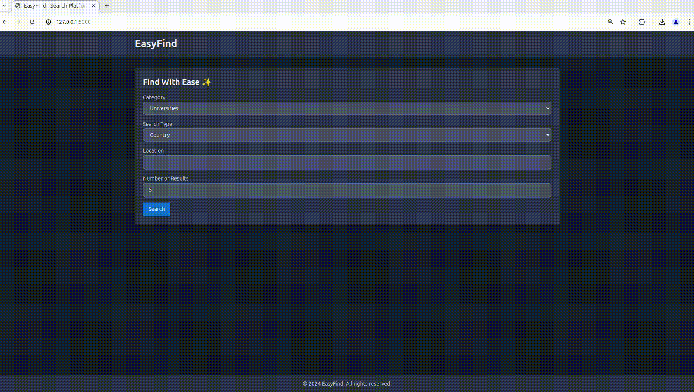

# EasyFind 🎯

**Discover with ease. Search for universities, companies, gyms, and more by city or country. Real-time updates and download compiled results in CSV.**

## 📖 Table of Contents

- [Features](#features-)
- [Demo](#demo-)
- [Installation](#installation-)
- [Usage](#usage-)
- [Contributing](#contributing-)
- [License](#license-)
- [Acknowledgements](#acknowledgements-)

## ✨ Features

- **🔍 Easy Search:** Search for various types of places by city or country.
- **⏱️ Real-Time Updates:** Get real-time progress updates during the search process.
- **📊 CSV Download:** Download search results in CSV format for easy access and sharing.

## 📹 Demo



## 🛠️ Installation

1. **Clone the repository:**

    ```sh
    git clone https://github.com/Sohaib-2/EasyFind.git
    cd easyfind
    ```

2. **Create a virtual environment and activate it:**

    ```sh
    python -m venv venv
    source venv/bin/activate  # On Windows use `venv\Scripts\activate`
    ```

3. **Install the dependencies:**

    ```sh
    pip install -r requirements.txt
    ```

## 🚀 Usage

1. **Run the application:**

    ```sh
    python run.py
    ```

2. **Open your web browser and go to `http://127.0.0.1:5000`.**

3. **Search for Places:**
    - Select a category (e.g., universities, software companies).
    - Choose whether to search by city or country.
    - Enter the location.
    - Specify the number of results.
    - Click "Search" to begin the search process.

4. **View Results:**
    - Watch the real-time progress updates.
    - View the results in a table.
    - Download the results in CSV format by clicking the "Download CSV" button.

## 🤝 Contributing

Contributions are welcome! Please follow these steps to contribute:

1. **Fork the repository.**
2. **Create a new branch:**

    ```sh
    git checkout -b feature/your-feature-name
    ```

3. **Make your changes and commit them:**

    ```sh
    git commit -am 'Add a descriptive commit message'
    ```

4. **Push to the branch:**

    ```sh
    git push origin feature/your-feature-name
    ```

5. **Open a pull request.**

## 🛠️ Tech Stack

- [Flask](https://flask.palletsprojects.com/)
- [Tailwind CSS](https://tailwindcss.com/)
- [Selenium](https://www.selenium.dev/)
- [Flask-SocketIO](https://flask-socketio.readthedocs.io/)
- [pandas](https://pandas.pydata.org/)

---

Thank you for using EasyFind! If you have any questions or feedback, feel free to open an issue or reach out to us. 😊
